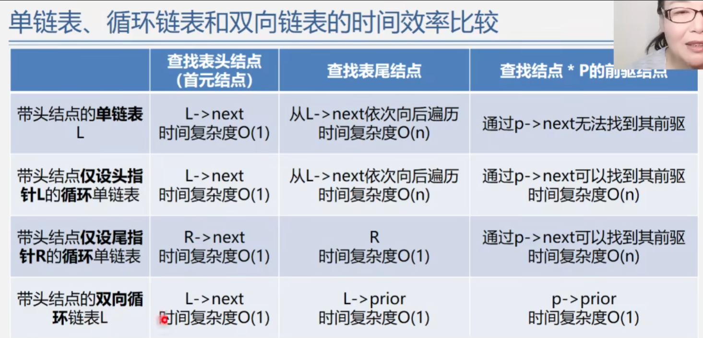

  

##    
数据结构

 

### 第二章: 线性表
 

#### 1.顺序表：
* #### 特点：元素在内存中连续存储，通过数组实现，支持随机访问。
* #### 用处：适用于频繁查找、较少插入和删除操作的场景。
* #### 优点：随机访问快速，空间利用率高。
* #### 缺点：插入和删除操作较慢，需要移动大量元素。
* #### 时间复杂度：查询、插入、删除操作的平均时间复杂度为O(n)。

#### 2.单链表：
* #### 特点：每个节点包含数据和指向下一个节点的指针，元素在内存中不一定连续存储。
* #### 用处：适用于频繁插入和删除操作的场景，不需要连续内存。
* #### 优点：插入和删除操作快速，只需修改指针，不需要移动元素。
* #### 缺点：随机访问较慢，需要从头开始遍历。
* #### 时间复杂度：查询操作的平均时间复杂度为O(n)，插入和删除操作的平均时间复杂度为O(1)。

#### 3.双向链表：
* #### 特点：每个节点包含数据和指向前一个节点和后一个节点的指针，支持双向遍历。
* #### 用处：适用于需要双向遍历的场景，比单链表更加灵活。
* #### 优点：在单链表的基础上，增加了双向遍历的能力，插入和删除操作更加灵活高效。
* #### 缺点：相对于单链表，节点占用更多内存空间。
* #### 时间复杂度：查询操作的平均时间复杂度为O(n)，插入和删除操作的平均时间复杂度为O(1)。

#### 4.循环链表：
* #### 特点：尾节点指针指向头节点，形成一个环状结构。
* #### 用处：适用于需要循环访问的场景，如循环队列。
* #### 优点：实现了循环遍历，不需要特殊处理尾节点。
* #### 缺点：插入和删除操作需要找到前一个节点，操作较复杂。
* #### 时间复杂度：查询操作的平均时间复杂度为O(n)，插入和删除操作的平均时间复杂度为O(1)。

#### 5.总结：

* #### 顺序表适用于频繁查询的场景，单链表适用于频繁插入和删除的场景，双向链表适用于双向遍历的场景,循环链表适用于循环访问的场景。顺序表的优点是随机访问快速，缺点是插入和删除慢；单链表的优点是插入和删除快，缺点是随机访问慢；双向链表在单链表基础上增加了双向遍历的能力；循环链表实现了循环访问，但插入和删除操作相对复杂。不同类型链表的时间复杂度与操作相关，但大多数操作的时间复杂度在平均情况下都是O(n)或O(1)。选择合适的数据结构取决于具体的应用需求和操作频率。

 

 

* #### 为什么在初始化和建立表的函数中要使用*L而不是直接使用L?

在初始化和建立表的函数中使用*L（指向指针的指针）是为了在函数内部修改传入的指针参数指向的地址，从而使得传入的指针参数在函数调用后仍然指向有效的内存地址。这样做是因为在C语言中，函数的参数传递是按值传递的，即传入函数的是参数的值的副本，而不是参数本身。如果在函数内部直接使用L，对L进行修改只是修改了参数的副本，而不会影响函数外部的原始指针。而使用*L（指向指针的指针）作为参数，传入的是指针变量的地址，这样在函数内部就可以通过*L解引用修改指针变量的值，从而使得函数外部的指针指向的地址也被修改。

具体来说，在InitList和CreateList_H、CreateList_T函数中，我们需要修改链表头指针L指向的地址，使得L在函数调用后依然指向有效的头结点地址。因此，我们需要传入LinkList *L类型的参数，即指向指针的指针。在函数内部，通过*L修改L指向的地址，从而确保函数外部的L仍然指向链表的头结点。

举例说明：(举例的代码函数见Linear_List/List_Link.c)

1. #### InitList(LinkList *L): L是指向指针的指针，传入的是main函数中的LinkList L的地址。在InitList函数内部，我们可以通过*L来修改main函数中的L的值（即头结点的地址）。

2. #### CreateList_H(LinkList *L, ElemType a[], int n): 同样，L是指向指针的指针，传入的是main函数中的LinkList L的地址。在CreateList_H函数内部，我们通过*L来修改main函数中的L的值，将其指向头插法建立的链表的头结点。

3. #### CreateList_T(LinkList *L, ElemType a[], int n): 同理，L是指向指针的指针，传入的是main函数中的LinkList L的地址。在CreateList_T函数内部，我们通过*L来修改main函数中的L的值，将其指向尾插法建立的链表的头结点。

通过使用*L传入指针参数，我们实现了在函数内部修改链表头指针，使得函数调用后，链表头指针依然有效，从而保持了对链表的持续访问和操作。

### 第三章: 栈与队列
#### 1.栈
* ####
#### 2.队列
* ####

